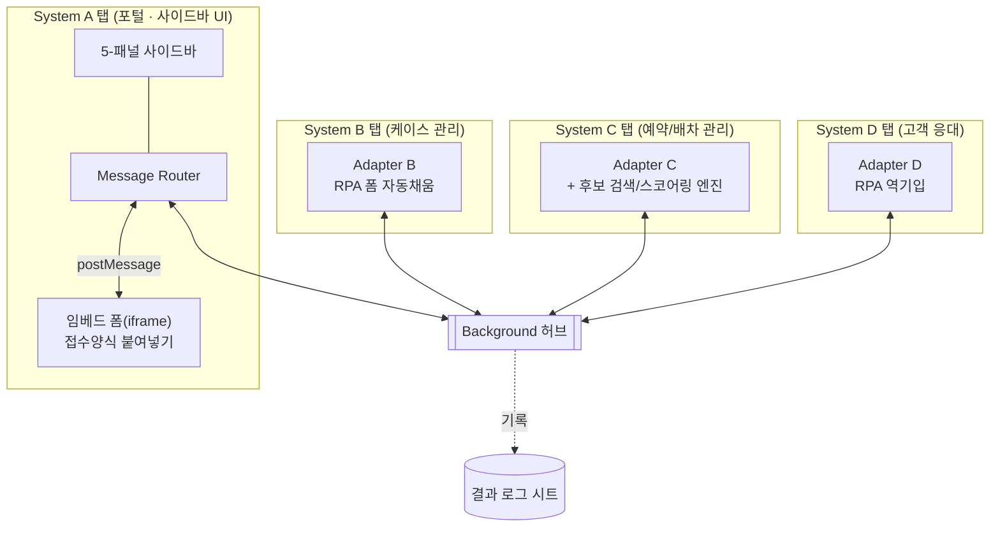

# SPOG Demo — 4개 사내 시스템을 잇는 크롬 확장 자동화

서로 연동되지 않는 4개의 사내 웹 시스템(포털/케이스 관리/예약·배차 관리/고객 응대)을
크롬 확장(Manifest V3) 하나로 이어붙여, 여러 화면을 오가며 같은 정보를 반복 입력하던
업무를 텍스트 한 번 붙여넣고 사이드바 버튼 몇 번으로 끝내는 자동화 데모입니다.

> 실제 사내 시스템명·도메인·필드명은 모두 제거하고 일반화했습니다. 자세한 내부 아키텍처
> 설계는 [`REFERENCE.md`](./REFERENCE.md)를 참고하세요. 이 README는 "이 프로젝트가 뭔지"를
> 빠르게 보여주는 용도이고, REFERENCE.md는 설계 문서입니다.

> 데모 영상: [`docs/demo.mp4`](./docs/demo.mp4) — 접수 카드 생성부터 사후관리 로그까지
> 전체 파이프라인이 실제 크롬 확장 동작으로 이어지는 모습입니다.

## 무엇을 자동화하는가

담당자가 접수양식(비정형 텍스트)을 받으면, 그 내용을 4개 시스템에 나눠서 손으로
옮겨 적어야 했습니다. 이 확장은 그 파이프라인 전체를 하나의 루프로 자동화합니다.

```
접수양식(텍스트)
   │  파싱 (라벨 텍스트 기반, 순서/공백에 관대)
   ▼
[System B 케이스 관리]  접수 카드 RPA 생성 — 폼 필드 자동 채움+제출, 휴먼에러 최소화
   │
   ▼
[System C 예약/배차 관리]  원버튼 자동화 3종
   ├─ 블록 생성
   ├─ 고객 예약 생성 ──────────────┐
   └─ 후보 검색·스코어링(좌표 거리)  │  (사용자 개입 없이 자동 연쇄)
                                    ▼
[System D 고객 응대]  예약정보를 응대 메모에 자동 역기입 + 인바운드 콜백 알림 수신
   │
   ▼
[결과 로그 시트]  각 스텝 완료마다 자동 기록 (쓰기 전용, 감사/추적용)
```

핵심은 특정 기능 하나(예: 후보 검색 알고리즘)가 아니라 **이 루프 전체가 사용자 개입
없이 이어진다는 것**입니다. 특히 "예약 생성 → 고객 응대 메모 자동 반영"은 사용자가
버튼을 누르지 않아도 백그라운드 허브가 자동으로 연쇄시킵니다.

## 사이드바 패널별 기능

5-패널 사이드바는 아이콘 레일로 전환합니다. 각 패널이 어떤 시스템과 연동하는지는 다음과 같습니다.

| 패널 | 연동 대상 | 하는 일 |
|---|---|---|
| 📥 인바운드 문의 | System D (고객 응대) | D에서 발생하는 콜백 알림을 수신 이력으로 표시. 접수 카드 생성과 달리 핵심 이벤트가 아니므로 패널을 강제로 바꾸지 않고 뱃지만 올립니다. |
| 📋 케이스 처리 *(기본 활성)* | System A 포털의 임베드 폼 → System B (케이스 관리) | 포털 페이지 본문(iframe)의 접수양식 텍스트를 읽어와 파싱하고, System B 탭으로 전환해 접수 카드 폼을 필드 하나씩 자동으로 채운 뒤 제출합니다(RPA). 파이프라인 진행 표시줄과 케이스 상세도 여기서 확인합니다. |
| 🚗 예약/배차 자동화 | System C (예약·배차 관리) → System D (자동 연쇄) | 원버튼 자동화 3종. **블록 생성**과 **고객 예약 생성**은 System C 탭으로 전환해 값을 순서대로 채워 넣고, 완료되면 사이드바 탭으로 자동 복귀합니다. 예약 생성이 끝나면 사용자 개입 없이 System D의 응대 메모에도 예약정보가 자동으로 반영됩니다(탭 전환 없이 백그라운드 처리). **후보 검색·스코어링**은 C의 결과 표를 읽어와 기준 좌표와의 거리로 점수를 매깁니다. |
| 🗂️ 사후관리 | 결과 로그 시트 (mock) | 케이스 생성부터 고객 응대 반영까지 각 스텝이 완료될 때마다 자동 기록된 로그를 확인합니다. 실 운영에서는 외부 스프레드시트 API 역할입니다. |
| ⚙️ 설정 | — | 알림 on/off 등 사이드바 자체의 환경설정입니다. |

## 아키텍처

4개 시스템은 서로 다른 탭(오리진)에서 열리고, API도 SSO도 공유하지 않습니다.
콘텐츠 스크립트들은 서로의 존재를 모르고, 오직 백그라운드 서비스워커(허브)를 통해서만
간접적으로 통신합니다.



내부 계층 구조, 메시지 버스 3단 구조, 상태 관리, 탭 오케스트레이션, 인터럽트 기반
패널 전환 등 상세 설계는 [`REFERENCE.md`](./REFERENCE.md)에 정리되어 있습니다.

## 실행 방법

사내 시스템 실물이 없으므로, 동일한 인터페이스로 동작하는 로컬 목업 6개(포트
8081~8086)를 함께 띄웁니다. 목업 페이지는 리액트(UMD, 로컬 벤더링, 빌드 없음)로
작성되어 상태가 화면에 실시간으로 반영됩니다. 확장 자체는 REFERENCE.md가 설명하는
실제 설계(번들러 미사용, 전역 네임스페이스 로딩)를 그대로 재현합니다.

```bash
npm run dev   # node mock-sites/server.js — 의존성 설치 불필요
```

이후 `chrome://extensions` → 개발자 모드 → "압축해제된 확장 프로그램 로드" →
`extension/` 디렉터리 선택.

## 데모 시나리오

1. `http://localhost:8081` 접속 → 사이드바가 자동 주입되고 "케이스 처리" 패널이 기본 활성화됩니다.
2. 임베드된 폼에 접수양식 텍스트를 붙여넣습니다.
   ```
   고객명: 홍길동
   연락처: 010-1234-5678
   식별코드: AB-1234
   접수일시: 2026-07-25 14:30
   위치: 서울시 강남구
   상세내용: 후방 추돌사고
   ```
3. "접수 카드 생성" 클릭 → 화면이 System B 탭으로 전환되며 폼 필드가 하나씩 순서대로
   채워지고 제출됩니다. 완료되면 사이드바 탭(System A)으로 자동 복귀하고, 접수 카드
   번호가 케이스 처리 패널에 표시됩니다.
4. "예약/배차 자동화" 패널에서 "블록 생성" → "후보 검색" 클릭 → 그때마다 System C 탭으로
   전환되어 값이 채워지는 과정을 보여주고, 끝나면 다시 사이드바 탭으로 돌아옵니다.
   후보 검색 결과는 좌표 기반으로 스코어링된 리스트로 표시됩니다.
5. "고객 예약 생성" 클릭 → System C 탭에서 예약이 생성되고 사이드바로 복귀합니다.
   이와 동시에 **사용자 개입 없이** System D의 응대 메모에도 예약정보가 자동으로
   채워집니다(D는 탭 전환 없이 백그라운드에서 조용히 처리).
6. `http://localhost:8084`에서 "콜백 발생 시뮬레이션"을 눌러보면, 사이드바는 패널을
   강제로 바꾸지 않고 "인바운드 문의" 뱃지만 올라갑니다 — 인터럽트 전환은 접수 카드
   생성처럼 핵심 이벤트에만 적용되기 때문입니다.
7. `http://localhost:8086`에서 지금까지의 모든 스텝이 로그로 기록된 것을 확인합니다.

## 디렉터리 구조

```
extension/            크롬 확장 (Manifest V3, 번들러 없음)
mock-sites/           로컬 목업 6개 오리진 (Node 내장 http만 사용, 의존성 0)
  vendor/             React/ReactDOM UMD 로컬 벤더링 (목업 페이지 전용)
docs/demo.mp4         데모 영상
REFERENCE.md          상세 아키텍처 설계 문서
SIDEBAR_UI_SPEC.md    사이드바 UI 스펙 문서
```
