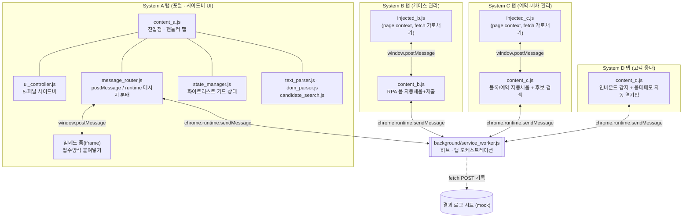
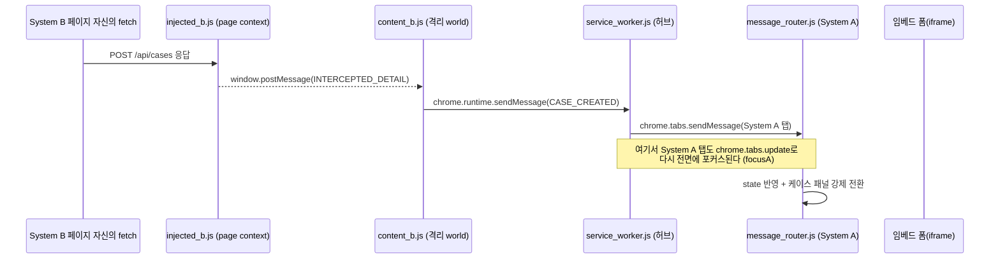

# SPOG Demo — 4개 사내 시스템을 잇는 크롬 확장 자동화

서로 연동되지 않는 4개의 사내 웹 시스템(포털/케이스 관리/예약·배차 관리/고객 응대)을
크롬 확장(Manifest V3) 하나로 이어붙여, 여러 화면을 오가며 같은 정보를 반복 입력하던
업무를 텍스트 한 번 붙여넣고 사이드바 버튼 몇 번으로 끝내는 자동화 데모입니다.

> 실제 사내 시스템명·도메인·필드명은 모두 제거하고 일반화했습니다. 아래 아키텍처 설명은
> `mock-sites/`(로컬 목업)가 아니라 **실제로 동작하는 `extension/` 코드**를 기준으로 합니다.

<video src="./docs/demo.mp4" autoplay loop muted playsinline controls width="720">
데모 영상: <a href="./docs/demo.mp4">docs/demo.mp4</a>
</video>

*접수 카드 생성부터 사후관리 로그까지 전체 파이프라인이 실제 크롬 확장 동작으로 이어지는 모습입니다.*

## 왜 만들었는가

담당자는 하나의 업무를 처리하기 위해 서로 인증·데이터 모델이 전혀 다른 4개의 내부 웹
시스템을 오가야 했습니다.

| 시스템 | 역할 |
|---|---|
| **System A (포털)** | 이 확장의 사이드바가 상주하는 곳. 업무의 시작점이자 조작 UI |
| **System B (케이스 관리)** | 접수 카드를 생성·조회하는 시스템 |
| **System C (예약·배차 관리)** | 예약, 차량 배정, 블록(일정 점유) 데이터를 다루는 시스템 |
| **System D (고객 응대)** | 인바운드 문의 이력과 응대 메모를 관리하는 시스템 |

4개 시스템은 API도 SSO도 공유하지 않습니다. 이 확장은 **4개의 탭에 각각 콘텐츠
스크립트를 심고, 백그라운드 서비스워커를 허브로 삼아 탭 간 메시지를 중계**함으로써,
사용자 눈에는 "하나의 사이드바에서 모든 시스템이 연동되는" 것처럼 보이게 만듭니다.

```
접수양식(텍스트)
   │  파싱 (라벨 텍스트 기반, 순서/공백에 관대)
   ▼
[System B 케이스 관리]  접수 카드 RPA 생성 — 폼 필드 자동 채움+제출, 휴먼에러 최소화
   │
   ▼
[System C 예약·배차 관리]  원버튼 자동화 3종
   ├─ 블록 생성
   ├─ 고객 예약 생성 ──────────────┐
   └─ 후보 검색·스코어링(좌표 거리)  │  (사용자 개입 없이 자동 연쇄)
                                    ▼
[System D 고객 응대]  예약정보를 응대 메모에 자동 역기입 + 인바운드 콜백 알림 수신
   │
   ▼
[결과 로그 시트]  각 스텝 완료마다 자동 기록 (쓰기 전용, 감사/추적용)
```

핵심은 특정 기능 하나(예: 후보 검색 알고리즘)가 아니라 **이 루프 전체가 사용자 개입
없이 이어진다는 것**입니다. 특히 "예약 생성 → 고객 응대 메모 자동 반영"은 사용자가
버튼을 누르지 않아도 백그라운드 허브가 자동으로 연쇄시킵니다.

## 핵심 기능

- **비정형 텍스트 → 구조화 필드 파싱** — 라벨 텍스트 기준 매핑(순서·공백에 관대). 상담원이 받아 적은 그대로의 텍스트를 그대로 붙여넣을 수 있습니다.
- **RPA 스타일 폼 자동 채움 + 제출** — 필드를 한 번에 채우지 않고 하나씩 순서대로 채우고, 제출 전 잠깐 멈춥니다. 실제 자동화 도구의 동작을 그대로 재현합니다.
- **시스템 간 자동 연쇄** — 예약 생성이 끝나면 사용자 클릭 없이 다른 시스템의 응대 메모까지 자동으로 채워집니다.
- **좌표 기반 후보 검색·스코어링** — DOM에 의존하지 않는 순수 함수로 분리되어 있어 유닛 테스트하기 좋습니다.
- **마크업 변화에 강한 동적 파싱** — 다른 시스템이 내려주는 HTML 표를 컬럼 인덱스가 아니라 헤더 텍스트로 매핑합니다.
- **탭 오케스트레이션** — 자동화 대상 탭이 없으면 대신 열어주고(find-or-create-tab), 있으면 화면을 그 탭으로 전환해 값이 채워지는 과정을 실시간으로 보여준 뒤 사이드바 탭으로 자동 복귀합니다.
- **서비스워커 재시작 복구** — MV3 서비스워커가 예고 없이 종료돼도, 상태를 재broadcast하고 사이드바가 다시 물어(`REQUEST_STATE`) 진행 상태를 복구합니다.
- **교차검증 방어 로직** — 임베드 폼의 원문 텍스트와 파싱 결과가 비어 있으면 자동화를 중단합니다.
- **인터럽트 기반 패널 전환 + 앰비언트 인디케이터** — 핵심 이벤트(접수 카드 생성)는 패널을 강제 전환하고, 부차적 이벤트(인바운드 콜백)는 뱃지만 올려 사용자 흐름을 방해하지 않습니다.
- **쓰기 전용 결과 로그** — 각 스텝 완료마다 감사/추적용 로그가 자동 기록됩니다.

## 사이드바 패널별 기능

5-패널 사이드바는 아이콘 레일로 전환합니다. 각 패널이 어떤 시스템과 연동하는지는 다음과 같습니다.

| 패널 | 연동 대상 | 하는 일 |
|---|---|---|
| 📥 인바운드 문의 | System D (고객 응대) | D에서 발생하는 콜백 알림을 수신 이력으로 표시. 접수 카드 생성과 달리 핵심 이벤트가 아니므로 패널을 강제로 바꾸지 않고 뱃지만 올립니다. |
| 📋 케이스 처리 *(기본 활성)* | System A 포털의 임베드 폼 → System B (케이스 관리) | 포털 페이지 본문(iframe)의 접수양식 텍스트를 읽어와 파싱하고, System B 탭으로 전환해 접수 카드 폼을 필드 하나씩 자동으로 채운 뒤 제출합니다(RPA). 파이프라인 진행 표시줄과 케이스 상세도 여기서 확인합니다. |
| 🚗 예약/배차 자동화 | System C (예약·배차 관리) → System D (자동 연쇄) | 원버튼 자동화 3종. **블록 생성**과 **고객 예약 생성**은 System C 탭으로 전환해 값을 순서대로 채워 넣고, 완료되면 사이드바 탭으로 자동 복귀합니다. 예약 생성이 끝나면 사용자 개입 없이 System D의 응대 메모에도 예약정보가 자동으로 반영됩니다(탭 전환 없이 백그라운드 처리). **후보 검색·스코어링**은 C의 결과 표를 읽어와 기준 좌표와의 거리로 점수를 매깁니다. |
| 🗂️ 사후관리 | 결과 로그 시트 (mock) | 케이스 생성부터 고객 응대 반영까지 각 스텝이 완료될 때마다 자동 기록된 로그를 확인합니다. 실 운영에서는 외부 스프레드시트 API 역할입니다. |
| ⚙️ 설정 | — | 알림 on/off 등 사이드바 자체의 환경설정입니다. |

## 아키텍처

> 아래는 `mock-sites/`가 아니라 실제 `extension/` 소스(파일명·메시지 타입·함수명)를 기준으로 설명합니다.

### 1. 전체 구조



핵심 설계 아이디어는 두 가지입니다.

1. **콘텐츠 스크립트는 서로 존재를 모른다.** `content_b.js`는 System C 탭이 열려 있는지조차 알지 못합니다. 오직 `chrome.runtime.sendMessage`로 백그라운드에게 "이런 이벤트가 발생했다"고 알릴 뿐이고, 어느 탭에 어떻게 전달할지는 `service_worker.js`가 결정합니다.
2. **System A 탭 내부는 계층으로 쪼갠다.** UI가 상주하는 탭은 코드량이 가장 많기 때문에, 상태·파싱·메시지 분배·렌더링을 파일 단위로 분리해 하나의 파일이 여러 책임을 갖지 않도록 했습니다.

<details>
<summary><b>더 자세한 아키텍처 설명 펼치기</b> — 모듈 구조 · 메시지 버스 3단 구조 · 상태 관리 · 탭 오케스트레이션 · 사이드바 인터럽트 · 엔드투엔드 예시 · 설계 결정 · 알려진 한계</summary>

### 2. 모듈 구조 (System A 탭 기준)

| 계층 | 파일 | 책임 |
|---|---|---|
| Config | `config.js` | 도메인 상수, 메시지 타입, 타임아웃 값을 `Object.freeze`로 동결해 `globalThis`에 등록. 콘텐츠 스크립트/서비스워커 양쪽에서 동일 소스를 참조 |
| State | `state_manager.js` | 클로저로 감춰진 단일 상태 객체 + `get/set/update` 접근자. 등록되지 않은 키에 접근하면 경고를 던지는 화이트리스트 가드 포함 |
| Parsers | `text_parser.js` | 비정형 접수양식 텍스트를 라벨 매칭으로 구조화 필드로 변환 |
| Parsers | `dom_parser.js` | 다른 시스템이 내려주는 HTML 표를 파싱. 컬럼 인덱스를 하드코딩하지 않고 헤더 텍스트를 동적으로 매핑 |
| Domain engine | `candidate_search.js` | 좌표 거리 계산, 후보 필터링·스코어링만 담당하는 순수 함수 (DOM 비의존) |
| Bridge / Bus | `message_router.js` | `window.postMessage` 수신과 `chrome.runtime.onMessage` 수신을 각각 "타입 → 핸들러" 매핑 테이블로 분배 |
| UI | `ui_controller.js` | 사이드바 DOM 생성, 5-패널 전환, 배지·트랙닷·파이프라인 진행 표시줄 렌더링 |
| Entry point | `content_a.js` | 진입 조건 확인 후 위 모듈을 초기화 순서대로 로드, 백그라운드 ↔ UI 사이의 핸들러 맵 보유 |

로드 순서 자체가 의존관계를 나타냅니다 (`manifest.json`의 `content_scripts.js` 배열 순서와 동일).

```
config → state → text_parser → dom_parser → candidate_search
       → message_router → ui_controller → content_a(init 호출)
```

Manifest V3 서비스워커는 파일 하나만 등록할 수 있기 때문에, `background/service_worker.js`는 `importScripts('../js/config.js')`로 config 모듈만 별도로 끌어와 상수를 공유합니다.

### 3. 메시지 버스: 3단 구조

브라우저 확장이라는 제약(격리된 실행 컨텍스트, 탭 간 직접 통신 불가) 때문에 통신 계층이 3단으로 나뉩니다.



**3-1. 페이지 컨텍스트 ↔ 콘텐츠 스크립트** (`injected_b.js` / `injected_c.js`)

콘텐츠 스크립트는 격리된 월드(isolated world)에서 실행되어 페이지의 `window.fetch`에 접근할 수 없습니다. 이를 우회하기 위해 `<script src="...">`로 실제 페이지 컨텍스트(MAIN world)에 스크립트를 주입하고, 가로챈 `fetch` 응답을 `window.postMessage`로 콘텐츠 스크립트에 되돌려줍니다.

```js
// injected_b.js — 페이지 컨텍스트(MAIN world)에서 실행
const originalFetch = window.fetch
window.fetch = async (...args) => {
  const response = await originalFetch(...args)
  const url = typeof args[0] === 'string' ? args[0] : args[0]?.url
  if (url?.includes('/api/cases') && response.ok) {
    const payload = await response.clone().json()
    window.postMessage({ type: 'INTERCEPTED_DETAIL', payload }, '*')
  }
  return response
}
```

**3-2. 콘텐츠 스크립트 ↔ 임베드 iframe** (`message_router.js`)

System A 페이지에는 별도 시스템이 만든 접수양식 폼이 iframe으로 임베드되어 있습니다. 콘텐츠 스크립트가 이 iframe의 최신 입력값이 필요할 때, 별도의 요청 ID 체계 없이 **"kind로 매칭 + 타임아웃 시 null 반환"** 하는 Promise 래퍼로 요청/응답을 짝짓습니다 (동시에 하나만 대기한다는 전제).

```js
// message_router.js
function requestIframeData(kind) {
  return new Promise((resolve) => {
    const timer = setTimeout(() => { cleanup(); resolve(null) }, SPOG_CONFIG.IFRAME_TIMEOUT_MS)
    function onMessage(event) {
      const msg = event.data
      if (msg?.type === SPOG_CONFIG.MSG.RESPONSE_DATA && msg.kind === kind) {
        clearTimeout(timer); cleanup(); resolve(msg.payload)
      }
    }
    function cleanup() { window.removeEventListener('message', onMessage) }
    window.addEventListener('message', onMessage)
    embedFrameWindow.postMessage({ type: SPOG_CONFIG.MSG.REQUEST_DATA, kind }, '*')
  })
}
```

**3-3. 콘텐츠 스크립트 ↔ 백그라운드 ↔ 다른 탭** (`background/service_worker.js`) — 허브 앤 스포크

가장 중요한 계층입니다. 서로 다른 탭(=서로 다른 사내 시스템)의 콘텐츠 스크립트는 직접 통신할 수 없으므로, 백그라운드 서비스워커가 허브 역할을 합니다.

```js
// background/service_worker.js
chrome.runtime.onMessage.addListener((message, sender) => {
  switch (message.type) {
    case SPOG_CONFIG.MSG.CASE_CREATED:
      updateTracking({ step: 'case_created', case: message.payload })
      broadcastToA(SPOG_CONFIG.MSG.CASE_CREATED, message.payload)
      logToSheet({ step: 'case_created', caseId: message.payload.caseId, /* ... */ })
      focusA() // 자동화 대상 탭에서 System A 탭으로 화면을 되돌린다
      break
    // ...
  }
})
```

수신 측(System A `content_a.js`)의 라우터는 스위치문 대신 **"타입 → 핸들러" 객체 리터럴 맵**으로 분배합니다. 새 이벤트를 추가할 때 분배 로직 자체는 건드리지 않고 맵에 한 줄만 추가하면 됩니다.

```js
// content_a.js
const HANDLERS = {
  [SPOG_CONFIG.MSG.CASE_CREATED]: (msg) => {
    SPOG_STATE.set('activeCase', msg.payload)
    SPOG_UI.onCriticalEventDetected(msg.payload) // 인터럽트 강제 전환
  },
  // ...
}
```

> 참고: 백그라운드 허브 쪽(`service_worker.js`)은 실제로는 스위치-케이스로 구현되어 있어, 콘텐츠 스크립트 쪽(맵 기반)과 분배 스타일이 다릅니다. 기능상 문제는 없지만 일관성 측면에서는 개선 여지가 있습니다 (§9 참고).

### 4. 상태 관리: 2단 상태 설계

이 확장에는 **두 종류의 상태**가 존재하고, 의도적으로 분리되어 있습니다.

- **탭 로컬 상태** (`state_manager.js`, System A 탭) — 페이지를 새로고침하면 사라지는 휘발성 상태. 클로저 안에 숨겨두고 화이트리스트 가드가 걸린 접근자로만 노출합니다.
- **허브 상태** (`background/service_worker.js`의 `hubState`) — 여러 탭에 걸쳐 지속되어야 하는 "현재 진행 중인 업무" 상태. MV3 서비스워커는 유휴 상태가 되면 언제든 종료(cold start)될 수 있기 때문에, 서비스워커가 재시작되어도 UI가 진행 상태를 다시 그릴 수 있도록 **각 스텝이 끝날 때마다 상태를 재broadcast**하고, System A는 로드 시 `REQUEST_STATE`로 다시 물어 복구합니다.

```js
// state_manager.js — 화이트리스트 가드가 있는 상태 저장소
const SPOG_STATE = (() => {
  const _state = { activeCase: null, vehicleCandidates: [], /* ... */ }
  const knownKeys = new Set(Object.keys(_state))
  function guard(key) {
    if (!knownKeys.has(key)) console.warn(`[SPOG_STATE] 알 수 없는 상태 키: ${key}`)
  }
  return {
    get(key) { guard(key); return _state[key] },
    set(key, value) { guard(key); _state[key] = value },
  }
})()
```

### 5. 탭 라이프사이클 오케스트레이션

백그라운드는 단순 메시지 중계자가 아니라, **필요한 시스템의 탭이 열려 있지 않으면 대신 열어주는** 오케스트레이터이기도 합니다. 사용자가 직접 트리거한 자동화(System B/C)는 탭을 **전면으로 가져와** 값이 순서대로 채워지는 과정을 실시간으로 보여주고, 완료되면 System A 탭으로 자동 복귀합니다. 반대로 예약 생성 후 System D로 가는 자동 연쇄처럼 사용자 개입이 없어야 하는 자동화는 탭 전환 없이 조용히 백그라운드에서 처리됩니다.

```js
// background/service_worker.js — find-or-create-tab 패턴 (focus 플래그로 두 모드 지원)
function runOnHost(pattern, entryUrl, message, focus) {
  chrome.tabs.query({ url: pattern }, (tabs) => {
    if (tabs.length > 0) {
      if (focus) {
        chrome.tabs.update(tabs[0].id, { active: true }, () => chrome.tabs.sendMessage(tabs[0].id, message))
      } else {
        chrome.tabs.sendMessage(tabs[0].id, message)
      }
      return
    }
    chrome.tabs.create({ url: entryUrl, active: !!focus }, (newTab) => {
      // 탭이 완전히 로드된 뒤, 페이지 자체 초기화 스크립트가 붙을 시간을 살짝
      // 기다렸다가(TAB_READY_DELAY_MS) 메시지를 전송한다.
    })
  })
}

function focusA() {
  chrome.tabs.query({ url: SPOG_CONFIG.PATTERNS.A }, (tabs) => {
    if (tabs[0]) chrome.tabs.update(tabs[0].id, { active: true })
  })
}
```

이 패턴은 반복되는 4~5곳에서 거의 동일한 모양으로 나타나며, `focus` 인자 하나로 "탭을 보여줄지(B/C 트리거) 조용히 처리할지(D 자동 연쇄)"를 구분합니다.

### 6. 사이드바 UI: 5-패널 구조와 앰비언트 인디케이터

사이드바는 하나의 창을 5개의 패널로 나눕니다 (자세한 내용은 [위 표](#사이드바-패널별-기능) 참고). 패널 자체보다 구조적으로 흥미로운 지점은 **탭이 활성화되어 있지 않을 때도 상태를 알려야 한다**는 요구에서 나온 두 가지 장치입니다.

1. **뱃지(badge)** — 카운터형 인디케이터. 비활성 패널에 처리 대기 건수를 숫자로 표시 (예: 인바운드 문의).
2. **트래킹 닷(track-dot)** — 이진 상태 인디케이터. 백그라운드 허브에서 broadcast된 이벤트가 현재 열려 있지 않은 패널에 영향을 줄 때, 아이콘 옆에 점을 켜서 "다른 탭에서 무언가 진행 중"임을 알립니다.

그리고 **인터럽트 기반 자동 전환** 규칙이 있습니다: 사용자가 어느 패널에 있든, 핵심 이벤트(접수 카드 생성)가 감지되면 강제로 케이스 처리 패널로 전환합니다. 반대로 인바운드 콜백처럼 부차적인 이벤트는 패널을 바꾸지 않고 뱃지만 올립니다. "사용자가 지금 보고 있는 화면"보다 "지금 가장 중요한 업무"를 우선시하는 의도적인 UX 선택입니다.

```js
// ui_controller.js
function onCriticalEventDetected(caseData) {
  renderCaseDetail(caseData)
  switchToPanel('case')       // 현재 활성 패널이 무엇이든 강제 전환
  markStepDone('case_created')
  setStatus('접수 카드 생성 완료', 'ok')
}
```

### 7. 엔드투엔드 예시: 접수 카드 생성 전체 흐름

```mermaid
sequenceDiagram
    participant User as 사용자
    participant A as content_a.js
    participant Iframe as 임베드 폼
    participant BG as service_worker.js
    participant B as content_b.js
    participant PageB as System B 페이지(fetch)

    User->>A: "접수 카드 생성" 클릭
    A->>Iframe: requestIframeData('intake_text')
    Iframe-->>A: 현재 입력값(원문 텍스트)
    alt 값이 비어 있음
        A->>User: alert — 처리 중단
    else 값 있음
        A->>A: text_parser로 필드 파싱
        A->>BG: RUN_CASE_CREATION { fields }
        BG->>B: chrome.tabs.update(active:true) + sendMessage
        Note over B: System B 탭이 화면 전면으로 전환됨
        B->>B: 필드 6개를 하나씩 채우고(RPA_FIELD_DELAY_MS)<br/>제출 버튼 클릭
        B->>PageB: 제출 → POST /api/cases
        PageB-->>B: injected_b.js가 응답 가로채 전달
        B->>BG: CASE_CREATED { caseId, ... }
        BG->>BG: hubState 갱신 + 결과 로그 시트에 기록
        BG->>A: broadcast(CASE_CREATED) + focusA()
        Note over A: System A 탭으로 자동 복귀
        A->>A: 케이스 패널 강제 전환 + 상세 렌더링
    end
```



"값이 비어 있으면 중단"은 서로 다른 시스템 간에 공유 트랜잭션이 없기 때문에, 확장 프로그램 스스로 정합성을 검증하고 불일치 시 자동화를 중단시키는 방어 로직입니다.

### 8. 설계 결정과 트레이드오프

| 결정 | 이유 |
|---|---|
| 콘텐츠 스크립트 간 직접 통신 금지, 백그라운드 허브 강제 | 브라우저 확장 모델 자체의 제약이기도 하지만, 탭 간 결합도를 낮춰 "System C 어댑터가 System B의 존재를 몰라도 되게" 만듦 |
| `Object.freeze`로 동결된 단일 config 모듈 + `globalThis` 공유 | 서비스워커(`importScripts`)와 콘텐츠 스크립트(`<script>` 로드) 양쪽에서 같은 상수를 참조. 엔드포인트/타임아웃이 여러 파일에 중복되는 것을 방지 |
| 상관관계 ID 없는 Promise+타임아웃 기반 iframe 요청 | 동시에 하나의 요청만 대기한다는 전제하에는 충분히 안전하고, 완전한 요청-ID 체계보다 코드가 훨씬 단순함 |
| 상태 스토어의 화이트리스트 가드 | TypeScript 없이도 오타로 인한 "조용한 실패"(존재하지 않는 키에 쓰고 읽기)를 콘솔 경고로 드러냄 |
| 백그라운드가 진행 상태를 재broadcast | MV3 서비스워커가 예고 없이 종료됐다가 재시작되는 것을 전제로, UI가 상태를 "다시 물어서" 복구할 수 있게 함 |
| 순수 도메인 로직(거리 계산, 후보 매칭)을 DOM 파서와 분리 | 거리/스코어링 로직은 DOM이 없어도 테스트 가능해야 한다는 원칙 |
| `runOnHost`의 `focus` 플래그로 탭 전환 여부 분기 | 사용자가 직접 트리거한 자동화는 눈으로 확인시키고, 자동 연쇄는 흐름을 방해하지 않도록 조용히 처리 |

### 9. 알려진 한계 (다음에 개선한다면)

포트폴리오 목적상, 실제로 존재하는 트레이드오프를 숨기지 않고 정리합니다.

- **분배 스타일 불일치** — 콘텐츠 스크립트 쪽은 객체 리터럴 맵(`content_a.js`), 백그라운드 쪽은 switch-case(`service_worker.js`)로 스타일이 갈립니다. 하나의 공통 디스패처 유틸로 통일할 수 있습니다.
- **모듈 로딩이 전역 네임스페이스 기반** — ES 모듈이 아니라 `globalThis.SPOG_*` 형태로 노출하고, 로드 순서를 `manifest.json`의 배열 순서에 의존합니다. 번들러(esbuild/webpack)를 도입하면 명시적 `import`로 의존관계를 드러낼 수 있습니다.
- **`ui_controller.js` 단일 파일이 비대함** — 패널 5개의 렌더링/이벤트 로직이 한 파일에 모여 있어, 패널별 파일 분리가 필요한 시점입니다.
- **자동화 테스트 부재** — `candidate_search.js`, `text_parser.js`, `dom_parser.js`처럼 순수 함수로 분리된 부분부터 유닛 테스트를 붙이기 좋은 구조입니다.
- **요청-ID 없는 iframe 브리지** — 현재 요구사항(동시 1건 대기)에서는 문제없지만, 동시 다발 요청이 필요해지면 상관관계 ID를 추가해야 합니다.
- **`postMessage`의 origin 미검증** — `message_router.js`/임베드 폼 모두 `postMessage(..., '*')`로 origin을 검증하지 않습니다. 로컬 데모 범위를 벗어나면 origin 화이트리스트 체크를 추가해야 합니다.

</details>

## 실행 방법

사내 시스템 실물이 없으므로, 동일한 인터페이스로 동작하는 로컬 목업 6개(포트
8081~8086)를 함께 띄웁니다. 목업 페이지는 리액트(UMD, 로컬 벤더링, 빌드 없음)로
작성되어 상태가 화면에 실시간으로 반영됩니다.

```bash
npm run dev   # node mock-sites/server.js — 의존성 설치 불필요
```

이후 `chrome://extensions` → 개발자 모드 → "압축해제된 확장 프로그램 로드" →
`extension/` 디렉터리 선택.

## 데모 시나리오

1. `http://localhost:8081` 접속 → 사이드바가 자동 주입되고 "케이스 처리" 패널이 기본 활성화됩니다.
2. 임베드된 폼에 접수양식 텍스트를 붙여넣습니다.
   ```
   고객명: 홍길동
   연락처: 010-1234-5678
   식별코드: AB-1234
   접수일시: 2026-07-25 14:30
   위치: 서울시 강남구
   상세내용: 일반 문의 접수
   ```
3. "접수 카드 생성" 클릭 → 화면이 System B 탭으로 전환되며 폼 필드가 하나씩 순서대로
   채워지고 제출됩니다. 완료되면 사이드바 탭(System A)으로 자동 복귀하고, 접수 카드
   번호가 케이스 처리 패널에 표시됩니다.
4. "예약/배차 자동화" 패널에서 "블록 생성" → "후보 검색" 클릭 → 그때마다 System C 탭으로
   전환되어 값이 채워지는 과정을 보여주고, 끝나면 다시 사이드바 탭으로 돌아옵니다.
   후보 검색 결과는 좌표 기반으로 스코어링된 리스트로 표시됩니다.
5. "고객 예약 생성" 클릭 → System C 탭에서 예약이 생성되고 사이드바로 복귀합니다.
   이와 동시에 **사용자 개입 없이** System D의 응대 메모에도 예약정보가 자동으로
   채워집니다(D는 탭 전환 없이 백그라운드에서 조용히 처리).
6. `http://localhost:8084`에서 "콜백 발생 시뮬레이션"을 눌러보면, 사이드바는 패널을
   강제로 바꾸지 않고 "인바운드 문의" 뱃지만 올라갑니다 — 인터럽트 전환은 접수 카드
   생성처럼 핵심 이벤트에만 적용되기 때문입니다.
7. `http://localhost:8086`에서 지금까지의 모든 스텝이 로그로 기록된 것을 확인합니다.

## 디렉터리 구조

```
extension/            크롬 확장 (Manifest V3, 번들러 없음)
mock-sites/           로컬 목업 6개 오리진 (Node 내장 http만 사용, 의존성 0)
  vendor/             React/ReactDOM UMD 로컬 벤더링 (목업 페이지 전용)
docs/demo.mp4         데모 영상 (README에 자동재생 임베드)
```

## License

[MIT](./LICENSE)
