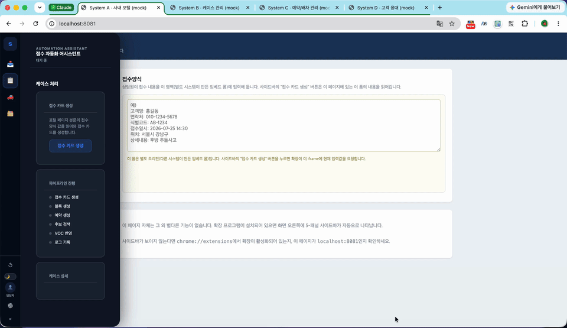
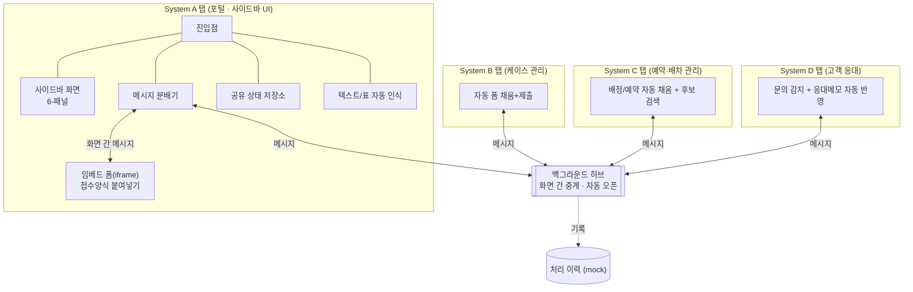
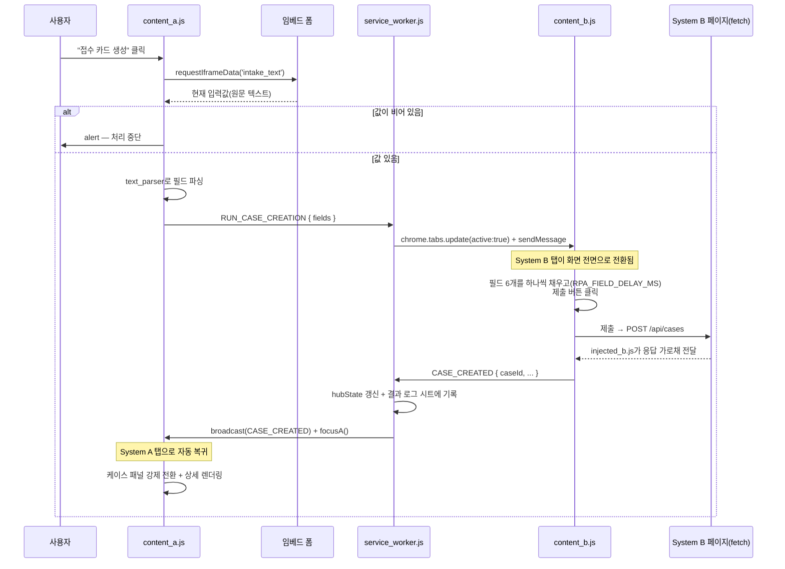

# SPOG Demo — 4개 사내 시스템을 잇는 크롬 확장 자동화

서로 연동되지 않는 4개의 사내 웹 시스템(포털/케이스 관리/예약·배차 관리/고객 응대)을
크롬 확장(Manifest V3) 하나로 이어붙여, 여러 화면을 오가며 같은 정보를 반복 입력하던
업무를 텍스트 한 번 붙여넣고 사이드바 버튼 몇 번으로 끝내는 자동화 데모입니다.

> 실제 사내 시스템명·도메인·필드명은 모두 제거하고 일반화했습니다. 아래 설명은
> **`extension/` 소스 구조와 로직**을 기준으로 합니다. 이 저장소는 로컬에서 바로 띄워보는
> 실행형 데모가 아니라, 구조와 자동화 로직을 보여주기 위한 참고용 슈도코드입니다.



*접수 카드 생성부터 사후관리 로그까지 전체 파이프라인이 실제 크롬 확장 동작으로 이어지는 모습입니다.
(GIF라 화질을 낮췄습니다 — 원본 화질은 [`docs/demo.mp4`](./docs/demo.mp4) 참고)*

## 어떤 문제를 해결했나

담당자는 하나의 업무를 처리하기 위해 서로 연동되지 않는 4개의 내부 웹 시스템을
번갈아 오가야 했습니다.

| 시스템 | 역할 |
|---|---|
| **System A (포털)** | 이 확장의 사이드바가 상주하는 곳. 업무의 시작점 |
| **System B (케이스 관리)** | 접수 건을 등록·조회하는 시스템 |
| **System C (예약·배차 관리)** | 예약, 차량 배정 데이터를 다루는 시스템 |
| **System D (고객 응대)** | 고객 문의 이력과 응대 메모를 관리하는 시스템 |

4개 시스템은 서로 로그인도, 데이터도 공유하지 않습니다. 그래서 담당자는 한 건을
처리하기 위해 4개 화면을 오가며 같은 내용을 여러 번 옮겨 적어야 했습니다. 이 확장은
그 4개 화면 각각에 자동화 코드를 심어두고, 사용자가 지금 보고 있는 화면(사이드바)에서
버튼 한 번을 누르면 **필요한 화면을 대신 열어(사용자 눈에 잠깐만 보였다가) 정보를
채워 넣거나 읽어오고, 결과만 사이드바로 모아** 보여줍니다. 사용자 입장에선 "여러
시스템을 오간다"가 아니라 "하나의 사이드바로 업무를 끝낸다"로 체감됩니다.

```
접수양식(텍스트)
   │  자동으로 항목별 정리
   ▼
[System B 케이스 관리]  접수 건 자동 등록 — 사람이 직접 입력할 필요 없이 자동 채움
   │
   ▼
[System C 예약·배차 관리]  원버튼 자동화 3종
   ├─ 배정 자동 등록
   ├─ 고객 예약 자동 등록 ──────────────┐
   └─ 가능한 차량 후보 자동 검색         │  (사람 개입 없이 다음 단계까지 자동 진행)
                                        ▼
[System D 고객 응대]  예약정보를 응대 메모에 자동 반영 + 고객 문의 알림 수신
   │
   ▼
[처리 이력 기록]  각 단계 완료마다 자동 기록(감사·추적용)
```

핵심은 기능 하나하나가 아니라 **이 전체 흐름이 사람 개입 없이 이어진다는 것**입니다.
특히 "예약 등록 → 고객 응대 메모 자동 반영"은 버튼을 한 번도 더 누르지 않아도
자동으로 이어지고, 진행 중인 시스템 화면이 잠깐씩 비쳐서 지금 무슨 작업이 되고
있는지 눈으로 확인할 수 있습니다.

모든 단계는 크게 둘로 나뉩니다: 다른 시스템에 새 정보를 **입력하는 작업**(폼 채우고
제출)과, 이미 있는 정보를 **가져와 보여주기만 하는 작업**(후보 검색)입니다. 사이드바는
각 단계 옆에 `✍️ 입력` / `📡 조회` 표시를 붙여 지금 하는 작업이 어느 쪽인지 바로
구분되게 합니다.

## 어떻게 동작하나

사이드바에서 버튼을 누르면, 그 요청이 실제 처리가 필요한 시스템의 화면까지 전달되고,
거기서 정말로 폼이 채워지거나 데이터가 조회된 뒤 결과가 다시 사이드바로 돌아옵니다 —
사용자는 그 중간 과정을 몰라도 됩니다.

이 확장은 처음부터 지금 모습이 아니었습니다. 예전 코드(순수 자바스크립트)를 걷어내고
한 번에 다시 만드는 대신, **화면(패널) 단위로 하나씩 최신 기술(React + TypeScript)로
옮겨가는 실제 마이그레이션 과정**을 그대로 반영했습니다 — 실무에서 자주 마주치는,
"운영 중인 서비스를 멈추지 않고 조금씩 개선하는" 상황을 재현한 것입니다. 사용하는
주요 기술은 React 19, TypeScript, Zustand(상태 관리), 크롬 확장 API(Manifest V3),
그리고 메시지 데이터가 올바른 형태인지 자동으로 검증하는 zod입니다. (파일 단위로 어떤
기술을 어디에 썼는지는 아래 "더 자세히 보기"에 정리돼 있습니다.)

## 무엇을 자동화했나

업무 하나를 처음부터 끝까지 따라가 보면 이렇습니다:

> 접수양식 텍스트를 붙여넣기 → 고객명·연락처·접수일시 등 항목별로 자동 정리
> → System B 화면으로 전환 → 해당 항목을 폼에 하나씩 자동 입력 → 제출 → System B가
> 새 접수 건을 만들고 접수번호를 돌려줌 → 그 번호가 사이드바에 즉시 표시됨 —
> **사용자는 System B 화면을 직접 들여다보지 않고도 사이드바에서 결과를 확인**합니다.

나머지 업무도 같은 방식으로 정리하면:

| 업무 | 유형 | 흐름 |
|---|---|---|
| 접수 건 등록 | 새 데이터 입력 | 텍스트 정리 → System B 폼 자동 입력·제출 → 접수번호 회신 → 사이드바에 즉시 표시 |
| 배정 등록 | 새 데이터 입력 | 예약ID 입력 → System C 폼 자동 채움·제출 → 배정 완료 → System C 화면에 새 항목 추가·강조 |
| 예약 등록 → 응대 반영 | 새 데이터 입력 + 자동 연계 | System C에서 예약 등록 → 완료 감지 → 사람 개입 없이 System D로 이동 → 응대 메모에 예약정보 자동 반영 → 사이드바로 복귀 |
| 가능한 차량 통합 조회 | 조회(여러 곳 통합) | 기준 지역부터 인접 지역까지 자동으로 넓혀가며 조회 → 가까운 순서로 정렬 → 흩어진 정보를 사이드바 한 화면에 통합 표시 |
| 고객 문의 알림 수신 | 실시간 알림 | System D에 문의가 들어오면 사이드바에 알림 표시(화면 전환 없이) |
| 처리 이력 기록 | 자동 기록 | 매 업무 완료 시 이력이 자동으로 남음(감사·추적용) |

**결과물**: 4개의 독립된 사내 시스템을 잇는 크롬 확장 1개, 자동화된 업무 6종, 27개
모듈로 구성.

**수치로 말할 수 있는 것** (구조적으로 확인 가능한 것만 — 실측 처리시간·오류율 같은
사내 운영 수치는 공개 대상이 아니라 여기 없습니다)
- 통합한 독립 시스템: 4개
- 화면 전환 없이 사이드바에서 결과 확인이 가능한 업무: 6개 중 6개
- 사람 개입 없이 자동으로 다음 단계까지 이어지는 업무: 1개(예약 등록 → 응대 반영)
- 화면에 오래된 정보가 잘못 표시되거나 꼬이는 상황을 막기 위한 안전장치: 서로 다른
  5가지 상황(중복 요청, 실패 재시도, 동시 조회, 방금 한 조작이 자동 새로고침에
  덮어써지는 것, 동시에 여러 번 새로고침될 때 서로의 결과를 지우는 것)에 각각 맞춰
  적용

## 핵심 기능

- **받아 적은 텍스트를 그대로 붙여넣기만 하면 자동 정리** — 상담원이 메모한 텍스트를 양식에 맞게 다시 옮겨 적을 필요 없이, 그대로 붙여넣으면 항목별로 자동 인식합니다.
- **사람처럼 폼을 채우고 제출** — 값을 한 번에 밀어넣지 않고 실제 사람이 입력하듯 하나씩 순서대로 채운 뒤 제출합니다.
- **시스템 간 자동 연계** — 한 시스템에서 작업이 끝나면, 사용자가 다시 클릭하지 않아도 다음 시스템으로 자동 이동해 관련 정보를 채우고 원래 화면으로 돌아옵니다.
- **지금 하는 일이 "입력"인지 "조회"인지 항상 표시** — 다른 시스템에 새 정보를 쓰는 중인지, 있는 정보를 읽어오기만 하는 중인지 한눈에 구분되게 표시합니다.
- **거리 기준 자동 정렬** — 가능한 후보를 가까운 순서로 자동 정렬해 보여줍니다.
- **화면 구조가 조금 바뀌어도 잘 안 깨짐** — 다른 시스템의 표를 고정된 위치가 아니라 제목 텍스트로 인식해서, 화면 레이아웃이 바뀌어도 잘 버팁니다.
- **필요한 화면을 알아서 열고 닫음** — 자동화에 필요한 화면이 안 열려 있으면 대신 열어주고, 작업이 끝나면 원래 보던 화면으로 자동 복귀합니다.
- **백그라운드 작업이 중간에 끊겨도 이어서 진행** — 브라우저가 절전 등으로 백그라운드 작업을 껐다 켜도, 하던 작업 상태를 그대로 복구해 이어갑니다.
- **입력 내용이 비정상이면 자동 중단** — 정보가 비어있거나 이상하면 자동화를 진행하지 않고 멈춰서 잘못된 데이터가 쓰이는 걸 막습니다.
- **중요한 일은 화면을 바로 보여주고, 급하지 않은 알림은 조용히 표시** — 접수 건 생성처럼 중요한 일은 화면을 자동으로 전환해 보여주고, 문의 알림처럼 급하지 않은 건 화면을 바꾸지 않고 알림 표시만 남깁니다.
- **같은 조회를 연달아 눌러도 화면엔 항상 최신 결과만** — 조회 버튼을 빠르게 여러 번 눌러도, 늦게 도착한 예전 응답이 화면에 뒤늦게 끼어들어 최신 결과를 덮어쓰지 않도록 처리했습니다.
- **방금 한 조작이 자동 새로고침 때문에 취소된 것처럼 보이는 문제 해결** — 게시글을 고정했는데 화면이 잠깐 원래대로 돌아갔다가 뒤늦게 다시 바뀌는 증상이 있었습니다. "방금 한 조작"과 "그 전에 이미 나가 있던 자동 새로고침 응답"의 순서를 서버 쪽에서 보장하도록 만들어 이 문제를 근본적으로 없앴습니다 — 이 프로젝트에서 가장 여러 번 다시 설계한 부분입니다.
- **여러 개의 자동 새로고침이 동시에 돌아도 서로의 결과를 안 지움** — 목록이 자동으로 갱신되는 화면에서, 서로 다른 새로고침이 동시에 일어나면 방금 생긴 항목이 잠깐 사라졌다 다시 나타나는 깜빡임이 있었습니다. 각 새로고침이 "이번에 실제로 확인한 범위"만 반영하도록 만들어 해결했습니다.

## 사이드바 패널별 기능

6-패널 사이드바는 아이콘 레일로 전환합니다. 각 패널이 어떤 시스템과 연동하는지는 다음과 같습니다.

| 패널 | 연동 대상 | 하는 일 |
|---|---|---|
| 📌 게시판 | 사내 포털 | 관리자가 올린 공지 목록을 주기적으로 자동 갱신하되, 공지 본문은 목록에 다 담지 않고 실제로 클릭해서 열 때만 따로 불러옵니다(불필요한 데이터 전송을 줄이기 위함). 고정·읽음 표시는 누르는 즉시 화면에 반영되고, 실패하면 원래대로 되돌립니다. |
| 📥 인바운드 문의 | System D (고객 응대) | D에서 발생하는 문의 알림을 이력으로 표시. 접수 건 생성과 달리 급한 일이 아니므로 화면을 바꾸지 않고 알림 표시만 올립니다. |
| 📋 케이스 처리 *(기본 활성)* | System A 포털의 임베드 폼 → System B (케이스 관리) | 포털 페이지 안 접수양식 텍스트를 읽어와 정리하고, System B 화면으로 전환해 접수 폼을 항목별로 자동 채운 뒤 제출합니다. 진행 상황과 처리 결과도 여기서 확인합니다. |
| 🚗 예약/배차 자동화 | System C (예약·배차 관리) → System D (자동 연계) | 원버튼 자동화 3종. **배정 등록**과 **고객 예약 등록**(✍️ 입력)은 System C 화면으로 전환해 값을 순서대로 채워 넣고, 완료되면 사이드바로 자동 복귀합니다. System C 화면에는 이 차량의 현황이 표로 쌓이고 방금 등록한 항목이 잠깐 강조됩니다. 이 목록은 자동 새로고침으로만 갱신되는데, 여러 새로고침이 동시에 일어나도 서로의 결과를 지우지 않도록 만들었습니다. 예약 등록이 끝나면 사람 개입 없이 System D로 이동해 응대 메모에도 예약정보를 반영한 뒤 사이드바로 복귀합니다. **후보 검색**(📡 조회)은 System C의 정보를 읽어와 거리순으로 정렬만 할 뿐, 새 데이터를 쓰지는 않습니다. 조회를 연달아 눌러도 화면엔 항상 최신 결과만 반영됩니다. |
| 🗂️ 사후관리 | 처리 이력 (mock) | 접수 건 생성부터 응대 반영까지 각 단계가 완료될 때마다 자동 기록된 이력을 확인합니다. |
| ⚙️ 설정 | — | 알림 on/off 등 사이드바 자체의 환경설정입니다. |

## 아키텍처

> 아래는 실제 `extension/` 소스(파일명·메시지 타입·함수명)를 기준으로 설명합니다. 여기부터는
> 기술적으로 더 깊이 들여다보고 싶은 분들을 위한 내용입니다 — 위 내용만으로도 프로젝트를
> 이해하는 데는 충분합니다.

레이어를 한눈에 보면 이렇습니다 — 사용자 입력이 아래로 내려가 자동화가 실행되고, 결과가 다시
위로 올라와 화면을 자동 갱신합니다.


더 아래 구조(파일 단위 모듈, 메시지 버스, 탭 오케스트레이션)는 다음 다이어그램과 코드로 이어집니다.



핵심 설계 아이디어는 두 가지입니다.

1. **각 화면의 자동화 코드는 서로의 존재를 모릅니다.** System B용 코드는 System C
   화면이 열려 있는지조차 모릅니다. 그저 "이런 일이 생겼다"고 백그라운드 허브에
   알릴 뿐이고, 어느 화면에 어떻게 전달할지는 허브가 정합니다 — 그래야 시스템 하나가
   추가·변경돼도 다른 시스템 코드를 건드릴 필요가 없습니다.
2. **사이드바가 있는 화면은 역할별로 잘게 나눴습니다.** 코드량이 가장 많은 곳이라,
   상태 관리·텍스트 인식·메시지 처리·화면 그리기를 파일 단위로 분리해서 파일 하나가
   여러 책임을 떠안지 않게 했습니다.

<details>
<summary><b>더 자세한 아키텍처 설명 펼치기</b> — 계층별 기술 스택 · 모듈 구조 · 메시지 버스 3단 구조 · 상태 관리 · 탭 오케스트레이션 · 사이드바 인터럽트 · 엔드투엔드 예시 · 설계 결정 · 알려진 한계</summary>

### 1. 계층별 기술 스택 요약

| 레이어 | 파일 | 스택 | 이유 |
|---|---|---|---|
| 제3자 페이지 자동화 | `content_b/c/d.js`, `service_worker.js` | 순수 JavaScript | 대상 페이지 안에 주입되는 코드라 프레임워크를 못 씀 |
| 사이드바 UI | `panels/*.tsx` | React 19 + TypeScript | 패널별 로컬 상태·리렌더링 관리 |
| 공유 상태 | `state/store.ts` | Zustand 5 | 여러 패널이 구독하는 전역 상태, `subscribe()` 지원 |
| 추적 상태 | `state/tracking_store.ts` | Zustand 5 | 폴링(스캔)으로만 확인 가능한 외부 데이터를 톰스톤+스코프 한정 병합으로 깜빡임 없이 추적 |
| 게시판 상태 | `state/bulletin_store.ts` | Zustand 5 | 낙관적 업데이트 + 실패 시 롤백, 본문 온디맨드 조회 |
| 레거시 호환 파사드 | `state/legacy_adapter.ts` | TypeScript | `ui_controller.js`/`message_router.ts`의 기존 호출부가 옛 `window.StateManager.get/set` API를 그대로 쓸 수 있게 함 |
| 메시지 검증 | `message_router.ts` | TypeScript + zod | 메시지 타입별 스키마 검증 + 3단계 오리진 검증(self/embed-sandbox/trusted-list) |
| 백엔드(경량) | `backend/mock_sidebar_webhook.js` | 순수 JavaScript | 스프레드시트+스크립트 런타임(Apps Script류) 위에서 도는 걸 흉내 — 목록/본문 이중 캐시, 멱등 쓰기 핸들러 |

### 2. 모듈 구조 (System A 탭 기준)

이 확장은 **두 기술스택의 하이브리드**입니다. 실제 원본이 처음부터 React였던
게 아니라, 순수 JS로 시작한 콘텐츠 스크립트 셸을 놔둔 채 **패널을 하나씩
React + TypeScript + Zustand로 옮겨가는 점진적 마이그레이션**이 진행 중인
구조를 그대로 반영했습니다.

| 계층 | 파일 | 스택 | 책임 |
|---|---|---|---|
| Config | `config.js` | JS | 도메인 상수, 메시지 타입, 타임아웃 값을 `Object.freeze`로 동결해 `globalThis`에 등록 |
| State (store) | `state/store.ts` | TS + Zustand | `createStore`로 만든 공유 상태 스토어. `subscribe()` 지원 |
| State (호환 파사드) | `state/legacy_adapter.ts` | TS | 구버전 `window.StateManager.get/set/update` API를 그대로 재현 — `message_router.ts`/`ui_controller.js`의 기존 호출부를 안 건드리기 위한 이음매 |
| State (배선) | `state/index.ts` | TS | `window.StateManager`/`window.ResourceStore` 전역 등록. React는 여기서 import하지 않음(패널이 실제 React로 옮겨진 곳에서만 로드) |
| State (훅) | `state/hooks.ts` | TS + React | `useSharedStore` — 패널 컴포넌트가 공유 스토어를 구독하는 훅 |
| Parsers | `text_parser.js` | JS | 비정형 접수양식 텍스트를 라벨 매칭으로 구조화 필드로 변환 |
| Parsers | `dom_parser.js` | JS | 다른 시스템이 내려주는 HTML 표를 파싱. 컬럼 인덱스를 하드코딩하지 않고 헤더 텍스트를 동적으로 매핑 |
| Domain engine | `candidate_search.js` | JS | 좌표 거리 계산, 후보 필터링·스코어링만 담당하는 순수 함수 (DOM 비의존) |
| Bridge / Bus | `message_router.ts` | TS + zod | 타입드 메시지 레지스트리(`registerRuntimeHandler`/`registerPostHandler`) — zod 스키마 검증 + 오리진 검증 + 타임아웃 가드를 한 곳에서 담당 |
| Panels | `js/panels/*.tsx` (6개) | TS + React + Zustand | 패널별 React 컴포넌트 + 패널 전용 로컬 Zustand 스토어. 각 파일이 `window.Panels`에도 자기 액션 네임스페이스(`caseActions`, `dispatchActions` 등)를 얹어 레거시 셸과 상호운용 |
| UI 셸 | `ui_controller.js` | JS | 패널 오케스트레이션만 담당하는 레거시 코어 — 인터럽트(강제 전환) vs 앰비언트(뱃지) 판단, 보안 타이머, MV3 재시작 복구. React로 옮겨지지 않고 남아있는 부분이며, React 패널이 마운트될 자리를 제공하고 `window.StateManager`를 계속 직접 호출 |
| Entry point | `content_a.js` | JS | 진입 조건 확인 후 `MessageRouter.init()` → `UiController.init()` 순서로 초기화만 수행 |

로드 순서 자체가 의존관계를 나타냅니다 (`manifest.json`의 `content_scripts.js` 배열 순서와 동일).

```
config → state/store → state/legacy_adapter → state/index
       → text_parser → dom_parser → candidate_search
       → message_router → ui_controller → panels/*(React 마운트)
       → content_a(init 호출)
```

Manifest V3 서비스워커는 파일 하나만 등록할 수 있기 때문에, `background/service_worker.js`는 `importScripts('../js/config.js')`로 config 모듈만 별도로 끌어와 상수를 공유합니다.

### 3. 메시지 버스: 3단 구조

브라우저 확장이라는 제약(격리된 실행 컨텍스트, 탭 간 직접 통신 불가) 때문에 통신 계층이 3단으로 나뉩니다.


**3-1. 페이지 컨텍스트 ↔ 콘텐츠 스크립트** (`injected_b.js` / `injected_c.js`)

콘텐츠 스크립트는 격리된 월드(isolated world)에서 실행되어 페이지의 `window.fetch`에 접근할 수 없습니다. 이를 우회하기 위해 `<script src="...">`로 실제 페이지 컨텍스트(MAIN world)에 스크립트를 주입하고, 가로챈 `fetch` 응답을 `window.postMessage`로 콘텐츠 스크립트에 되돌려줍니다.

```js
// injected_b.js — 페이지 컨텍스트(MAIN world)에서 실행
const originalFetch = window.fetch
window.fetch = async (...args) => {
  const response = await originalFetch(...args)
  const url = typeof args[0] === 'string' ? args[0] : args[0]?.url
  if (url?.includes('/api/case/detail') && response.ok) {
    const payload = await response.clone().json()
    window.postMessage({ type: 'INTERCEPTED_CASE', payload: extractCaseFields(payload), __spogToken: RPA_MSG_TOKEN }, '*')
  }
  return response
}
```

**3-2. 콘텐츠 스크립트 ↔ 임베드 iframe** (`message_router.ts`)

System A 페이지에는 별도 시스템이 만든 접수양식 폼이 iframe으로 임베드되어 있습니다. 콘텐츠 스크립트가 이 iframe의 최신 입력값이 필요할 때, 별도의 요청 ID 체계 없이 **"kind로 매칭 + 타임아웃 시 null 반환"** 하는 Promise 래퍼로 요청/응답을 짝짓습니다 (동시에 하나만 대기한다는 전제 — §9의 알려진 한계 참고). 이 iframe은 포털 자신의 origin이 아니라 별도 샌드박스 도메인에서 렌더링되므로, 응답을 받을 때 `validatePostOrigin(event, 'embed-sandbox')`로 suffix 기반 오리진 검증을 거친 뒤에만 신뢰합니다.

```js
// message_router.ts
function getEmbedFormData(kind) {
  return new Promise((resolve) => {
    const timer = setTimeout(() => { cleanup(); resolve(null) }, RPA_APP_CONFIG.TIMEOUT.ELEMENT_DEFAULT)
    function onMessage(event) {
      if (!validatePostOrigin(event, 'embed-sandbox')) return
      const msg = event.data
      if (msg?.type === 'RESPONSE_DATA' && msg.kind === kind) {
        clearTimeout(timer); cleanup(); resolve(msg.payload)
      }
    }
    function cleanup() { window.removeEventListener('message', onMessage) }
    window.addEventListener('message', onMessage)
    embedFrameWindow.postMessage({ type: 'REQUEST_DATA', kind }, '*')
  })
}
```

**3-3. 콘텐츠 스크립트 ↔ 백그라운드 ↔ 다른 탭** (`background/service_worker.js`) — 허브 앤 스포크

가장 중요한 계층입니다. 서로 다른 탭(=서로 다른 사내 시스템)의 콘텐츠 스크립트는 직접 통신할 수 없으므로, 백그라운드 서비스워커가 허브 역할을 합니다.

```js
// background/service_worker.js — 타입별로 개별 리스너를 등록하는 방식
chrome.runtime.onMessage.addListener((msg, sender, sendResponse) => {
  if (msg.type !== 'INTERCEPTED_CASE') return false
  broadcastToPortal(msg) // System A 탭 전체에 push
  sendLog({ step: 'case_created', caseId: msg.caseId, at: new Date().toISOString() })
  return false
})
```

수신 측(System A `message_router.ts`)은 타입드 레지스트리로 분배합니다. 새 이벤트를 추가할 때 분배 로직 자체는 건드리지 않고 등록 한 줄만 추가하면 됩니다.

```js
// message_router.ts
registerRuntimeHandler('INTERCEPTED_CASE', (m) => !!m.caseId, handleInterceptedCase)
// handleInterceptedCase 내부에서 StateManager.update(...) + UiController.onCaseConnected()로
// 인터럽트(강제 패널 전환)를 트리거한다.
```

> 참고: 백그라운드 허브 쪽(`service_worker.js`)은 타입별 개별 `addListener` 등록 방식이고, System A 쪽(`message_router.ts`)은 스키마 검증 + 오리진 검증 + 타임아웃 가드를 갖춘 레지스트리입니다. 기능상 문제는 없지만 두 계층의 분배 스타일이 다른 점은 개선 여지가 있습니다 (§9 참고).

### 4. 상태 관리: 2단 상태 설계

이 확장에는 **두 종류의 상태**가 존재하고, 의도적으로 분리되어 있습니다.

- **탭 로컬 상태** (`state/store.ts`, System A 탭) — 페이지를 새로고침하면 사라지는 휘발성 상태. 실제 Zustand `createStore`로 만든 스토어이며, 레거시 호출부는 `state/legacy_adapter.ts`의 화이트리스트 가드 파사드로만 접근합니다.
- **허브 상태** (`background/service_worker.js`의 `hubState`) — 여러 탭에 걸쳐 지속되어야 하는 "현재 진행 중인 업무" 상태. MV3 서비스워커는 유휴 상태가 되면 언제든 종료(cold start)될 수 있기 때문에, 서비스워커가 재시작되어도 UI가 진행 상태를 다시 그릴 수 있도록 **각 스텝이 끝날 때마다 상태를 재broadcast**하고, System A는 로드 시 `REQUEST_STATE`로 다시 물어 복구합니다.

레거시 콘텐츠 스크립트(`message_router.ts`, `ui_controller.js`)와 React로 이전된
패널이 **같은 스토어를 두 가지 방식으로 공유**하는 구조입니다 — 빅뱅 재작성 없이
점진적으로 이관하기 위한 이음매입니다.

```ts
// state/legacy_adapter.ts — 화이트리스트 가드가 있는 구버전 호환 파사드
// (내부적으로는 진짜 Zustand 스토어(state/store.ts)를 감싼 얇은 층)
export const legacyStateManager = {
  get(key: string) { _guard(key); return sharedStore.getState()[key as StateKey] },
  set(key: string, value: unknown) { _guard(key); sharedStore.setState({ [key]: value }) },
  update(key: string, partial: object) { /* 객체 상태만 부분 병합 — 배열/원시값이면 경고 후 무시 */ },
}

// state/hooks.ts — React로 이전된 패널은 이 훅으로 같은 스토어를 직접 구독
export function useSharedStore<T>(selector: (s: SharedState) => T): T {
  return useStore(window.ResourceStore, selector)
}
```

### 5. 탭 라이프사이클 오케스트레이션

백그라운드는 단순 메시지 중계자가 아니라, **필요한 시스템의 탭이 열려 있지 않으면 대신 열어주는** 오케스트레이터이기도 합니다. 사용자가 직접 트리거한 자동화(System B/C)든, 예약 생성 후 System D로 가는 자동 연쇄든 구분 없이 대상 탭을 **전면으로 가져와** 처리 과정을 실시간으로 보여주고, 완료되면 원래 탭(System A/사이드바)으로 자동 복귀합니다. 지금 어느 시스템이 처리되고 있는지를 매번 탭 전환으로 드러내는 대신, 여러 스텝이 연달아 일어나면 짧게 여러 번 탭이 전환됩니다 — 이 "탭이 오가는 흐름" 자체가 4개 시스템이 하나로 통합돼 있음을 보여주는 장치입니다.

```js
// background/service_worker.js — find-or-create-tab 패턴 (focus 플래그는 항상 true로 호출됨)
function runOnHost(pattern, entryUrl, message, focus) {
  chrome.tabs.query({ url: pattern }, (tabs) => {
    if (tabs.length > 0) {
      if (focus) {
        chrome.tabs.update(tabs[0].id, { active: true }, () => chrome.tabs.sendMessage(tabs[0].id, message))
      } else {
        chrome.tabs.sendMessage(tabs[0].id, message)
      }
      return
    }
    chrome.tabs.create({ url: entryUrl, active: !!focus }, (newTab) => {
      // 탭이 완전히 로드된 뒤, 페이지 자체 초기화 스크립트가 붙을 시간을 살짝
      // 기다렸다가(TAB_READY_DELAY_MS) 메시지를 전송한다.
    })
  })
}

function focusPortal() {
  chrome.tabs.query({ url: URL_PATTERNS.PORTAL }, (tabs) => {
    if (tabs[0]) chrome.tabs.update(tabs[0].id, { active: true })
  })
}
```

이 패턴은 반복되는 4~5곳에서 거의 동일한 모양으로 나타납니다. `focus` 인자는 여전히 남아있지만 모든 호출부가 `true`를 넘겨, 사용자가 직접 누른 자동화든 자동 연쇄든 항상 탭을 보여준 뒤 되돌아오게 — 지금 무엇이 처리되고 있는지 눈으로 보이는 것을 우선시합니다. "이 스텝이 대상 시스템에 데이터를 쓰는지(✍️), 읽어와 집계만 하는지(📡)"는 별도의 `kind` 태그(사이드바 §6)로 구분해서 보여줍니다.

### 6. 사이드바 UI: 6-패널 구조와 앰비언트 인디케이터

사이드바는 하나의 창을 6개의 패널로 나눕니다 (자세한 내용은 [위 표](#사이드바-패널별-기능) 참고). 패널 자체보다 구조적으로 흥미로운 지점은 **탭이 활성화되어 있지 않을 때도 상태를 알려야 한다**는 요구에서 나온 장치들입니다.

1. **뱃지(badge)** — 카운터형 인디케이터. 비활성 패널에 처리 대기 건수를 숫자로 표시 (예: 인바운드 문의).
2. **트래킹 닷(track-dot)** — 이진 상태 인디케이터. 백그라운드 허브에서 broadcast된 이벤트가 현재 열려 있지 않은 패널에 영향을 줄 때, 아이콘 옆에 점을 켜서 "다른 탭에서 무언가 진행 중"임을 알립니다.
3. **쓰기/읽기 태그(kind-tag)** — 파이프라인 진행 표시줄과 각 자동화 카드 제목 옆에 `✍️ 쓰기` / `📡 읽기`를 붙여, 지금 방문 중인(또는 방문했던) 탭에서 대상 시스템에 데이터를 쓰고 있는지, 이미 있는 데이터를 API 응답에서 읽어와 사이드바에 집계만 하고 있는지를 구분합니다.

그리고 **인터럽트 기반 자동 전환** 규칙이 있습니다: 사용자가 어느 패널에 있든, 핵심 이벤트(접수 카드 생성)가 감지되면 강제로 케이스 처리 패널로 전환합니다. 반대로 인바운드 콜백처럼 부차적인 이벤트는 패널을 바꾸지 않고 뱃지만 올립니다. "사용자가 지금 보고 있는 화면"보다 "지금 가장 중요한 업무"를 우선시하는 의도적인 UX 선택입니다 — `ui_controller.js`는 이 판단(인터럽트 vs 앰비언트)만 하고, 실제 렌더링은 `js/panels/*.tsx`에 위임합니다.

```js
// ui_controller.js
function onCaseConnected() {
  switchPanel('panel-case', { forced: true }) // 현재 활성 패널이 무엇이든 강제 전환
}
function onInboundCountUpdated(count) {
  Panels.inboundActions.setBadgeCount(count)  // 패널 전환 없이 뱃지 숫자만 갱신
}
```

### 7. 엔드투엔드 예시: 접수 카드 생성 전체 흐름



"값이 비어 있으면 중단"은 서로 다른 시스템 간에 공유 트랜잭션이 없기 때문에, 확장 프로그램 스스로 정합성을 검증하고 불일치 시 자동화를 중단시키는 방어 로직입니다.

### 8. 설계 결정과 트레이드오프

| 결정 | 이유 |
|---|---|
| 콘텐츠 스크립트 간 직접 통신 금지, 백그라운드 허브 강제 | 브라우저 확장 모델 자체의 제약이기도 하지만, 탭 간 결합도를 낮춰 "System C 어댑터가 System B의 존재를 몰라도 되게" 만듦 |
| `Object.freeze`로 동결된 단일 config 모듈 + `globalThis` 공유 | 서비스워커(`importScripts`)와 콘텐츠 스크립트(`<script>` 로드) 양쪽에서 같은 상수를 참조. 엔드포인트/타임아웃이 여러 파일에 중복되는 것을 방지 |
| 상관관계 ID 없는 Promise+타임아웃 기반 iframe 요청 | 동시에 하나의 요청만 대기한다는 전제하에는 충분히 안전하고, 완전한 요청-ID 체계보다 코드가 훨씬 단순함 |
| 상태 스토어의 화이트리스트 가드 | TypeScript 없이도 오타로 인한 "조용한 실패"(존재하지 않는 키에 쓰고 읽기)를 콘솔 경고로 드러냄 |
| 백그라운드가 진행 상태를 재broadcast | MV3 서비스워커가 예고 없이 종료됐다가 재시작되는 것을 전제로, UI가 상태를 "다시 물어서" 복구할 수 있게 함 |
| 순수 도메인 로직(거리 계산, 후보 매칭)을 DOM 파서와 분리 | 거리/스코어링 로직은 DOM이 없어도 테스트 가능해야 한다는 원칙 |
| `runOnHost`를 항상 `focus:true`로 호출 + 완료 시 항상 원래 탭으로 복귀 | 자동 연쇄(C→D)까지도 "지금 어느 시스템이 처리 중인지"를 탭 전환으로 보여주는 것이 4개 시스템 통합을 드러내는 데 더 중요하다고 판단 — 대신 쓰기/읽기 여부는 `kind` 태그로 별도 표시 |
| 후보 검색: 잠금(lock) 대신 세대(generation) 카운터로 중복요청 무시 | 후보 검색 화면은 사내 서버가 매번 새로 만들어주는 응답을 그대로 읽어오는 방식이라, 응답 대기 중 사용자가 다음 요청을 보내면 뒤늦게 오는 이전 응답은 이미 쓸모없어짐. 그대로 반영하면 최신 화면이 예전 화면으로 되돌아가는 렉처럼 보이므로, 요청을 막거나 대기시키는 대신 상관관계ID(caseId)별 세대 번호만 올리고 오래된 세대의 응답은 보고 직전에 조용히 버림 |
| 게시판 쓰기를 백그라운드 허브 경유로 강제 + 쓰기 세대 카운터 | 사이드바가 백엔드에 직접 쓰던 구조에서는 배경 폴링과의 순서를 보장할 방법이 없었음. 허브를 반드시 거치게 하고, 쓰기 시작 시점마다 세대 번호를 올려 그 이전에 나가있던 폴링 응답을 무효화하는 방식으로 근본 해결 |
| 추적 목록은 "스코프 한정 병합"으로 갱신 | 폴링(스캔)으로만 상태를 아는 외부 시스템을 추적할 때, 서로 다른 스캔 결과가 상대의 발견을 지워버리는 문제가 있었음. 각 스캔이 실제로 훑은 범위 밖의 기존 항목은 결과에 없어도 건드리지 않도록 제한 |

### 9. 알려진 한계 (다음에 개선한다면)

포트폴리오 목적상, 실제로 존재하는 트레이드오프를 숨기지 않고 정리합니다.

- **디스패치 스타일이 계층별로 다름** — `message_router.ts`는 타입드 registry(스키마 검증 + 오리진 검증 + 타임아웃 가드)를 쓰지만, `service_worker.js`는 아직 타입별 개별 리스너 등록 방식입니다. 백그라운드 쪽도 같은 registry로 통일할 수 있습니다.
- **모듈 로딩이 전역 네임스페이스 기반** — ES 모듈이 아니라 `window.SPOG_*`/`window.Panels` 형태로 노출하고, 로드 순서를 `manifest.json`의 배열 순서에 의존합니다. 번들러(esbuild/webpack)를 도입하면 명시적 `import`로 의존관계를 드러낼 수 있습니다.
- **`Panels` 네임스페이스가 암묵적으로 합성됨** — `js/panels/*.tsx` 6개 파일이 각자 `window.Panels = window.Panels || {}`로 같은 객체에 자기 액션을 얹는 방식이라, 파일 로드 순서가 깨지면 특정 패널 액션이 조용히 `undefined`가 됩니다. 명시적 레지스트리로 바꾸면 이 암묵적 의존을 없앨 수 있습니다.
- **자동화 테스트 부재** — `candidate_search.js`, `text_parser.js`, `dom_parser.js`처럼 순수 함수로 분리된 부분부터 유닛 테스트를 붙이기 좋은 구조입니다.
- **요청-ID 없는 iframe 브리지** — 현재 요구사항(동시 1건 대기)에서는 문제없지만, 동시 다발 요청이 필요해지면 상관관계 ID를 추가해야 합니다.

</details>

## 데모 시나리오

위 GIF에 담긴 흐름을 순서대로 풀면 다음과 같습니다.

1. 사이드바가 System A(포털)에 자동 주입되고 "케이스 처리" 패널이 기본 활성화됩니다.
2. 임베드된 폼에 접수양식 텍스트를 붙여넣습니다.
   ```
   고객명: 홍길동
   연락처: 010-1234-5678
   식별코드: AB-1234
   접수일시: 2026-07-25 14:30
   위치: 서울시 강남구
   상세내용: 일반 문의 접수
   ```
3. "접수 카드 생성"(✍️ 쓰기) 클릭 → 화면이 System B 탭으로 전환되며 폼 필드가 하나씩
   순서대로 채워지고 제출됩니다. 완료되면 사이드바 탭(System A)으로 자동 복귀하고,
   접수 카드 번호가 케이스 처리 패널에 표시됩니다.
4. "예약/배차 자동화" 패널에서 "블록 생성"(✍️ 쓰기) → "후보 검색"(📡 읽기) 클릭 → 그때마다
   System C 탭으로 전환되어 값이 채워지거나 결과가 조회되는 과정을 보여주고, 끝나면
   다시 사이드바 탭으로 돌아옵니다. 카드 제목 옆 태그로 지금 이 동작이 System C에
   데이터를 쓰는 것인지, 이미 있는 데이터를 읽어오는 것인지 구분됩니다. System C
   화면에는 "예약블록 현황" 표가 있어, 방금 생성한 블록이 새 행으로 추가되며 잠깐
   노란색으로 강조됐다가 가라앉습니다(실제 사내 시스템이 액션 직후 갱신된 목록을
   보여주는 방식 그대로). 후보 검색 결과는 좌표 기반으로 정렬된 리스트로 표시되며,
   "후보 검색"을 빠르게 두 번 눌러도 표는 항상 마지막 요청의 결과만 반영합니다 —
   먼저 보낸 요청의 응답이 뒤늦게 와도 화면에 반영하지 않고 조용히 버리기 때문입니다.
5. "고객 예약 생성"(✍️ 쓰기) 클릭 → System C 탭에서 예약이 생성되고(예약 현황 표에
   새 행이 추가·강조됨) 사이드바로 복귀합니다. 곧이어 **사용자 클릭 없이** System D
   탭으로 전환되어 응대 메모에 예약정보가 자동으로 채워지고, 완료되면 다시 사이드바로
   돌아옵니다 — C 자동화가 끝나자마자 D 탭이 짧게 열렸다 돌아오는 것을 눈으로 확인할
   수 있습니다.
6. System D에서 인바운드 콜백이 발생하면, 사이드바는 패널을 강제로 바꾸지 않고
   "인바운드 문의" 뱃지만 올립니다 — 인터럽트 전환은 접수 카드 생성처럼 핵심
   이벤트에만 적용되기 때문입니다.
7. 지금까지의 모든 스텝이 결과 로그 시트에 자동 기록된 것을 확인합니다.

## 디렉터리 구조

```
extension/            크롬 확장 (Manifest V3, 번들러 없음) — 구조/로직 참고용 슈도코드
docs/demo.gif         데모 (README에 반복재생 임베드)
docs/demo.mp4         데모 원본 화질
```

## License

[MIT](./LICENSE)
