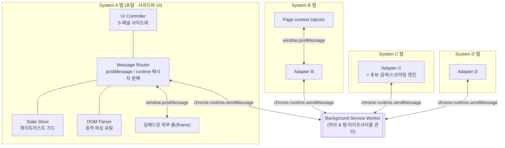
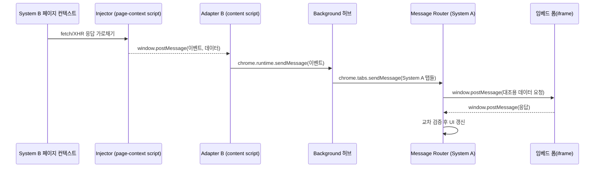
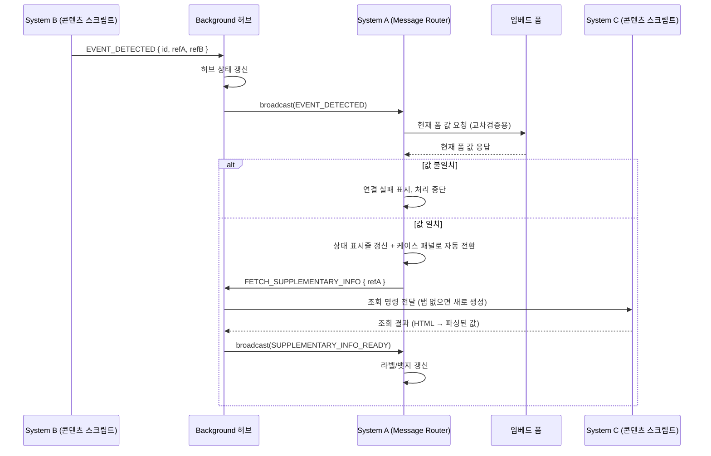

# Architecture

> 이 문서는 여러 개의 서로 연동되지 않는 사내 웹 시스템을 하나의 크롬 확장(Chrome Extension, Manifest V3)으로 이어 붙여
> 반복 업무를 자동화하는 프로젝트의 구조를 설명합니다.
> 실제 사내 시스템명·도메인·API 경로·데이터 필드명은 모두 제거하고 일반화된 이름으로 대체했습니다.
> 코드 스니펫은 실제 소스가 아니라 패턴을 보여주기 위한 의사코드입니다.

---

## 1. 문제 정의

담당자는 하나의 업무를 처리하기 위해 서로 인증·데이터 모델이 전혀 다른 4개의 내부 웹 시스템을 오가야 했습니다.

| 시스템 | 역할 |
|---|---|
| **System A (포털)** | 커스텀 위젯(사이드바)을 얹을 수 있는 사내 포털 페이지. 업무의 시작점이자 조작 UI가 상주하는 곳 |
| **System B (케이스 관리)** | 접수 카드를 생성·조회하고 알림을 발송하는 시스템 |
| **System C (예약/배차 관리)** | 예약, 차량 배정, 블록(일정 점유) 데이터를 다루는 시스템 |
| **System D (고객 응대)** | 인바운드 문의 이력을 관리하는 시스템 |

이 4개 시스템은 서로 API를 공유하지 않고, SSO도 부분적으로만 되어 있었습니다. 이 확장 프로그램은 **4개의 탭에 각각 콘텐츠 스크립트를 심고, 백그라운드 서비스워커를 허브로 삼아 탭 간 메시지를 중계**함으로써, 사용자 눈에는 "하나의 사이드바에서 모든 시스템이 연동되는" 것처럼 보이게 만듭니다.

---

## 2. 전체 구조



핵심 설계 아이디어는 두 가지입니다.

1. **콘텐츠 스크립트는 서로 존재를 모른다.** System B의 어댑터는 System C 탭이 열려 있는지조차 알지 못합니다. 오직 백그라운드에게 "이런 이벤트가 발생했다"고 알릴 뿐이고, 어느 탭에 어떻게 전달할지는 백그라운드가 결정합니다.
2. **각 탭 내부는 계층으로 쪼갠다.** 특히 UI가 상주하는 System A 탭은 코드량이 가장 많기 때문에, 상태·파싱·메시지 분배·렌더링을 파일 단위로 분리해 하나의 파일이 여러 책임을 갖지 않도록 했습니다.

---

## 3. 모듈 구조 (System A 탭 기준)

실제 파일은 `js/` 아래 평평하게(flat) 놓여 있지만, 각 파일은 아래와 같은 단일 책임을 갖도록 설계했습니다.

| 계층 | 실제 파일(일반화) | 책임 |
|---|---|---|
| **Config** | `config.js` | 도메인 상수, 타임아웃 값, 스토리지 키를 `Object.freeze`로 동결해 `globalThis`에 등록. content script / service worker 양쪽에서 동일 소스를 import |
| **State** | `state_manager.js` | 클로저로 감춰진 단일 상태 객체 + `get/set/update` 접근자. 등록되지 않은 키에 접근하면 경고를 던지는 화이트리스트 가드 포함 |
| **Parsers** | `dom_parser.js` | 외부 시스템이 내려주는 HTML을 파싱. 컬럼 인덱스를 하드코딩하지 않고 헤더 텍스트를 동적으로 매핑해 마크업이 바뀌어도 깨지지 않게 방어 |
| **Domain engine** | `candidate_search.js` | 좌표 거리 계산, 후보 필터링/등급 매칭 등 순수 도메인 로직만 분리 (DOM에 의존하지 않음) |
| **Bridge / Bus** | `message_router.js` | `window.postMessage` 수신과 `chrome.runtime.onMessage` 수신을 각각 "타입 → 핸들러" 매핑 테이블로 분배 |
| **UI** | `ui_controller.js` | 사이드바 DOM 생성, 5-패널 전환, 배지/인디케이터 렌더링 |
| **Entry point** | `content_google.js` | 진입 조건(정확한 페이지인지) 체크 후 위 모듈들을 초기화 순서대로 로드 |

로드 순서 자체가 의존관계를 나타냅니다.

```
config → state → parser → message-router → ui-controller → entry-point(init 호출)
```

Manifest V3 서비스워커는 파일 하나만 등록할 수 있기 때문에, 백그라운드는 `importScripts()`로 config 모듈만 별도로 끌어와 상수를 공유합니다.

---

## 4. 메시지 버스: 3단 구조

브라우저 확장이라는 제약(격리된 실행 컨텍스트, 탭 간 직접 통신 불가) 때문에 통신 계층이 3단으로 나뉩니다.



### 4-1. 페이지 컨텍스트 ↔ 콘텐츠 스크립트

콘텐츠 스크립트는 격리된 월드(isolated world)에서 실행되어 페이지의 `window` 객체(즉, 페이지가 호출하는 `fetch`/`XHR`)에 접근할 수 없습니다. 이를 우회하기 위해 `<script src="...">` 형태로 실제 페이지 컨텍스트에 스크립트를 주입하고, 가로챈 네트워크 응답을 `window.postMessage`로 콘텐츠 스크립트에 되돌려줍니다.

```
// 의사코드 — page-context injector
const injected = document.createElement('script')
injected.src = extension.getURL('injected-entry.js')
document.head.appendChild(injected)

// injected-entry.js (페이지 컨텍스트에서 실행됨)
const originalFetch = window.fetch
window.fetch = async (...args) => {
    const response = await originalFetch(...args)
    if (matchesTargetEndpoint(args[0])) {
        const cloned = await response.clone().json()
        window.top.postMessage({ type: 'INTERCEPTED_DETAIL', payload: extract(cloned) }, '*')
    }
    return response
}
```

### 4-2. 콘텐츠 스크립트 ↔ 임베드 iframe (요청/응답 상관관계)

System A 페이지에는 별도 시스템이 만든 폼이 iframe으로 임베드되어 있습니다. 콘텐츠 스크립트가 이 iframe의 최신 입력값이 필요할 때, 별도의 요청 ID 체계 없이 **"타입으로 매칭 + 타임아웃 시 null 반환"** 하는 Promise 래퍼로 요청/응답을 짝짓습니다.

```
// 의사코드 — 단발성 요청은 요청ID 없이도 안전하게 처리 가능 (동시에 하나만 대기하는 전제)
function requestIframeData(kind) {
    return new Promise((resolve) => {
        const timer = setTimeout(() => { cleanup(); resolve(null) }, TIMEOUT_MS)
        function onMessage(event) {
            if (event.data?.type === 'RESPONSE_DATA' && event.data.kind === kind) {
                clearTimeout(timer); cleanup(); resolve(event.data.payload)
            }
        }
        function cleanup() { window.removeEventListener('message', onMessage) }
        window.addEventListener('message', onMessage)
        targetFrame.postMessage({ type: 'REQUEST_DATA', kind }, '*')
    })
}
```

### 4-3. 콘텐츠 스크립트 ↔ 백그라운드 ↔ 다른 탭 (허브 앤 스포크)

가장 중요한 계층입니다. 서로 다른 탭(=서로 다른 사내 시스템)의 콘텐츠 스크립트는 직접 통신할 수 없으므로, 백그라운드 서비스워커가 허브 역할을 합니다.

```
// 의사코드 — background hub
onMessage((message) => {
  switch (message.type) {
    case 'EVENT_DETECTED_ON_B':
      updateSharedState(message.payload)
      broadcastToTabsMatching(HOST_A_PATTERN, message)
      break
    case 'RUN_AUTOMATION_ON_C':
      findOrCreateTab(HOST_C_PATTERN, HOST_C_ENTRY_URL, (tab) => {
        sendMessageToTab(tab, message)
      })
      break
  }
})
```

수신 측(System A)의 라우터는 스위치문 대신 **"타입 → 핸들러" 객체 리터럴 맵**으로 분배합니다. 새 이벤트를 추가할 때 분배 로직(`addEventListener`)을 건드리지 않고 맵에 한 줄만 추가하면 됩니다.

```
// 의사코드 — object-literal dispatch map
const handlers = {
  EVENT_A: (msg) => renderPanelA(msg),
  EVENT_B: (msg) => crossValidateAndRender(msg),
  EVENT_C: (msg) => updateBadge(msg.count),
}

addRuntimeMessageListener((msg) => handlers[msg.type]?.(msg))
```

> 참고: 백그라운드 허브 쪽은 실제로는 스위치-케이스로 구현되어 있어, 콘텐츠 스크립트 쪽(맵 기반)과 분배 스타일이 다릅니다. 기능상 문제는 없지만 일관성 측면에서는 개선 여지가 있는 부분입니다 (§7 참고).

---

## 5. 상태 관리: 2단 상태 설계

이 확장에는 **두 종류의 상태**가 존재하고, 의도적으로 분리되어 있습니다.

- **탭 로컬 상태 (콘텐츠 스크립트)** — 페이지를 새로고침하면 사라지는 휘발성 상태. 클로저 안에 숨겨두고 화이트리스트 가드가 걸린 접근자로만 노출합니다.
- **허브 상태 (백그라운드)** — 여러 탭에 걸쳐 지속되어야 하는 "현재 진행 중인 업무" 상태. Manifest V3의 서비스워커는 유휴 상태가 되면 언제든 종료(cold start)될 수 있기 때문에, 서비스워커가 재시작되어도 UI가 진행 상태를 다시 그릴 수 있도록 **상태를 주기적으로 재브로드캐스트**하는 패턴을 씁니다.

```
// 의사코드 — 화이트리스트 가드가 있는 상태 저장소
const StateStore = (() => {
  const _state = { activeCase: null, cachedVehicleId: null /* ... */ }
  const knownKeys = new Set(Object.keys(_state))

  function guard(key) {
    if (!knownKeys.has(key)) warn(`알 수 없는 상태 키: ${key}`)
  }

  return {
    get(key)          { guard(key); return _state[key] },
    set(key, value)   { guard(key); _state[key] = value },
    update(key, part) { guard(key); _state[key] = { ..._state[key], ...part } },
  }
})()
```

```
// 의사코드 — 서비스워커 재시작 대비: 진행 상태를 다시 알림
function onWorkStarted(payload) {
  hubState.tracking = { active: true, ...payload }
  broadcastToTabsMatching(HOST_A_PATTERN, { type: 'WORK_STARTED', tracking: hubState.tracking })
}
// 이후 각 단계가 끝날 때마다 hubState.tracking 을 갱신하고 다시 broadcast
```

---

## 6. 탭 라이프사이클 오케스트레이션

백그라운드는 단순 메시지 중계자가 아니라, **필요한 시스템의 탭이 열려 있지 않으면 대신 열어주는** 오케스트레이터이기도 합니다.

```
// 의사코드 — find-or-create-tab 패턴
function runOnHost(pattern, entryUrl, message) {
  queryTabs({ url: pattern }, (tabs) => {
    if (tabs.length > 0) {
      sendMessageToTab(tabs[0], message)
    } else {
      createTab({ url: entryUrl, active: false }, (newTab) => {
        onTabUpdated((tabId, info) => {
          if (tabId === newTab.id && info.status === 'complete') {
            removeThisListener()
            // 페이지 자체 초기화 스크립트가 붙을 시간을 살짝 기다렸다가 전송
            delay(TAB_READY_DELAY, () => sendMessageToTab(newTab, message))
          }
        })
      })
    }
  })
}
```

이 패턴은 반복되는 4~5곳에서 거의 동일한 모양으로 나타나며, 유일한 차이는 "탭이 이미 열려 있을 때 포커스를 가져올지(foreground) 말지(background)"뿐입니다.

---

## 7. 사이드바 UI: 5-패널 구조와 앰비언트 인디케이터

사이드바는 하나의 창을 5개의 패널(탭)로 나눕니다.

| 패널 | 목적 |
|---|---|
| Panel · 인바운드 문의 | System D 이벤트 수신 및 관련 이력 표시 |
| Panel · 케이스 처리 *(기본 활성)* | 핵심 업무 플로우. 진입 시 항상 이 패널이 열려 있음 |
| Panel · 예약/배차 조회 | System C 연동 조회·조작 |
| Panel · 사후관리 | 배치 작업(예: 다건 일괄 검수) |
| Panel · 설정 | 연동 대상, 알림 등 환경설정 |

구조적으로 흥미로운 지점은 패널 자체보다 **탭이 활성화되어 있지 않을 때도 상태를 알려야 한다**는 요구에서 나온 두 가지 장치입니다.

1. **뱃지(badge)** — 카운터형 인디케이터. 비활성 패널에 처리 대기 건수를 숫자로 표시.
2. **트래킹 닷(track-dot)** — 이진 상태 인디케이터. 백그라운드 허브에서 broadcast된 이벤트가 현재 열려 있지 않은 패널에 영향을 줄 때, 탭 아이콘 옆에 점을 켜서 "다른 탭에서 무언가 진행 중"임을 알립니다.

그리고 **인터럽트 기반 자동 전환** 규칙이 있습니다: 사용자가 어느 패널에 있든, 핵심 이벤트(예: 새 케이스 연결)가 감지되면 강제로 케이스 처리 패널로 전환합니다. 이는 "사용자가 지금 보고 있는 화면"보다 "지금 가장 중요한 업무"를 우선시하는 의도적인 UX 선택입니다.

```
// 의사코드 — 인터럽트 기반 패널 전환
function onCriticalEventDetected(event) {
  renderCaseDetails(event)
  switchToPanel('panel-case')       // 현재 활성 패널이 무엇이든 강제 전환
  setBadge('panel-inbound', unreadCount)
  setTrackDot('panel-dispatch', hasPendingDispatchWork)
}
```

---

## 8. 엔드투엔드 예시 (일반화)

아래는 "System B에서 특정 이벤트가 감지되면, System A UI가 갱신되고 필요 시 System C에서 부가 정보를 조회한다"는 흐름을 일반화한 것입니다.



여기서 "교차검증"은 서로 다른 시스템이 준 데이터가 실제로 같은 건을 가리키는지 확인하는 방어 로직입니다. 두 시스템 간에는 공유 트랜잭션이 없기 때문에, 확장 프로그램 스스로 정합성을 검증하고 불일치 시 자동화를 중단시킵니다.

---

## 9. 설계 결정과 트레이드오프

| 결정 | 이유 |
|---|---|
| 콘텐츠 스크립트 간 직접 통신 금지, 백그라운드 허브 강제 | 브라우저 확장 모델 자체의 제약이기도 하지만, 탭 간 결합도를 낮춰 "System C 어댑터가 System B의 존재를 몰라도 되게" 만듦 |
| `Object.freeze`로 동결된 단일 config 모듈 + `globalThis` 공유 | 서비스워커(`importScripts`)와 콘텐츠 스크립트(`<script>` 로드) 양쪽에서 같은 상수를 참조. 엔드포인트/타임아웃이 여러 파일에 중복되는 것을 방지 |
| 상관관계 ID 없는 Promise+타임아웃 기반 iframe 요청 | 동시에 하나의 요청만 대기한다는 전제하에는 충분히 안전하고, 완전한 요청-ID 체계보다 코드가 훨씬 단순함 |
| 상태 스토어의 화이트리스트 가드 | TypeScript 없이도 오타로 인한 "조용한 실패"(존재하지 않는 키에 쓰고 읽기)를 콘솔 경고로 드러냄 |
| 백그라운드가 진행 상태를 주기적으로 재broadcast | MV3 서비스워커가 예고 없이 종료됐다가 재시작되는 것을 전제로, UI가 상태를 "다시 물어서" 복구할 수 있게 함 |
| 순수 도메인 로직(거리 계산, 후보 매칭)을 DOM 파서와 분리 | 거리/스코어링 로직은 DOM이 없어도 테스트 가능해야 한다는 원칙 |

---

## 10. 알려진 한계 (다음에 개선한다면)

포트폴리오 목적상, 실제로 존재하는 트레이드오프를 숨기지 않고 정리합니다.

- **분배 스타일 불일치** — 콘텐츠 스크립트 쪽은 객체 리터럴 맵, 백그라운드 쪽은 switch-case로 스타일이 갈립니다. 하나의 공통 디스패처 유틸로 통일할 수 있습니다.
- **모듈 로딩이 전역 네임스페이스 기반** — ES 모듈이 아니라 `window.ModuleName` 형태로 노출하고, 로드 순서를 `manifest.json`의 배열 순서에 의존합니다. 번들러(esbuild/webpack)를 도입하면 명시적 `import`로 의존관계를 드러낼 수 있습니다.
- **UI 컨트롤러 단일 파일이 비대함** — 패널 5개의 렌더링/이벤트 로직이 한 파일에 모여 있어, 패널별 파일 분리가 필요한 시점입니다.
- **자동화 테스트 부재** — DOM 파싱 로직(§3 Parsers)처럼 순수 함수로 분리된 부분부터 유닛 테스트를 붙이기 좋은 구조입니다.
- **요청-ID 없는 iframe 브리지** — 현재 요구사항(동시 1건 대기)에서는 문제없지만, 동시 다발 요청이 필요해지면 상관관계 ID를 추가해야 합니다.
